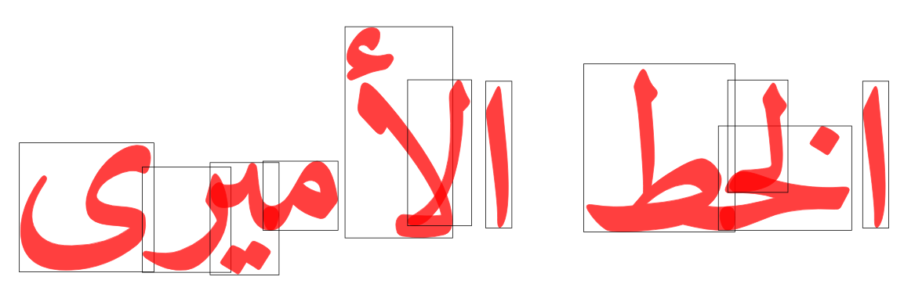

# WASM for NodeJS Sample Application

<!-- START doctoc generated TOC please keep comment here to allow auto update -->
<!-- DON'T EDIT THIS SECTION, INSTEAD RE-RUN doctoc TO UPDATE -->
**Table of Contents**  *generated with [DocToc](https://github.com/thlorenz/doctoc)*

- [What it Does](#what-it-does)
- [What it Is](#what-it-is)
- [How Does it Compare](#how-does-it-compare)
- [Caveats](#caveats)
- [Steps to Follow](#steps-to-follow)
- [Installation](#installation)
- [Publish Compiled WASM Code](#publish-compiled-wasm-code)
- [Command Lines](#command-lines)
- [To Do](#to-do)
- [Rendering](#rendering)

<!-- END doctoc generated TOC please keep comment here to allow auto update -->

## What it Does

This module allows users to take a Unicode text and a path to a font file as inputs and obtain a list of
GlyfIDs and 2D positions back. This process is known as [text
shaping](https://en.wikipedia.org/wiki/Complex_text_layout). It is an indespensible ingredient for
compositing text in so-called 'complex' writing systems like Arabic and Indic alphabets, but even when
applied to text written in the Latin alphabet, there are finer points of typesetting like
[kerning](https://en.wikipedia.org/wiki/Kerning) and the choice of
[ligatures](https://en.wikipedia.org/wiki/Orthographic_ligature) which makes this process too difficult to
be reasonably implemented on-the-fly for each piece of software that uses text. Instead, what one wants is a
specialized library that knows lots of details about font file formats, OpenType font features, type metrics
and so on and applies that knowledge to a given text string to derive poisitioning data for the individual
graphical pieces ('glyfs') that, when drawn out on a canvas (such as an HTML `<canvas>` or an `<svg>`
element) then instruct the rendering software to render an aesthetically pleasing and orthographically
correct (image of a) text. You can see all this in action in the [live HarfBuzz demo
page](https://harfbuzz.github.io/harfbuzzjs/). If you want to know more about text shaping, be sure to read
[Ramsey Nasser's *Unplain text: A primer on text shaping and rendering non-Latin text in the shadow of an
ASCII-dominated world*](https://increment.com/programming-languages/unplain-text-primer-on-non-latin/);
also, you might want to take a look at the [HarfBuzz terminology
glossary](https://harfbuzz.github.io/terminology.html).


The leading free software to provide text shaping is [HarfBuzz](https://harfbuzz.github.io/) ([repo
here](https://github.com/harfbuzz/harfbuzz)), which is written in C++.
[`rustybuzz`](https://github.com/RazrFalcon/rustybuzz) is "is a complete harfbuzz's shaping algorithm port
to Rust", and since it's written in Rust, we can compile it to WASM and write a nice API surface for it,
which is what I did.



*Sample in Arabic, using the [Amiri Typeface](https://www.amirifont.org/)* to type out "الخط الأمیری".
Notice visible overlaps and tasteful placement of complex ligatures.


## What it Is

To implement `rustybuzz-wasm` I started with [the example shipped with
`rustybuzz`](https://github.com/RazrFalcon/rustybuzz/blob/master/examples/shape.rs) which compiles to an
executable that accepts a path to a font file and a text and then echoes a containing glyf IDs and
positioning data. This I turned into [a minimalist version with WASM entry
points](https://github.com/loveencounterflow/rustybuzz-wasm/blob/master/src/lib.rs). There's still a lot
missing, especially font feature selection, but since everything went so well so far, I guess I'll get to
that later.

## How Does it Compare

* `rustybuzz-wasm` is not feature-complete with `rustybuzz`, yet.
* `rustybuzz-wasm` would appear to be 1.5 times faster than
  [`harfbuzzjs`](https://github.com/harfbuzz/harfbuzzjs) (which is what drives the [HarfBuzz demo
  page](https://harfbuzz.github.io/harfbuzzjs/)]). `harfbuzzjs` does not allow arbitrarily long lines and
  does not support font features (which `rustybuzz` will probably soon have).
* `rustybuzz-wasm` is over 3 times faster than using
  [`opentype.js`](https://github.com/opentypejs/opentype.js).
* HarfBuzz does have command line utilities, too (referred to as `harfbuzzjs_shaping` in the below benchmark
  results), but the fact that one has to open a sub-process for each piece of text and re-read font files
  damages performance a great deal. This means that `rustybuzz-wasm` (running as WASM attached to a NodeJS
  process) is over 12 times as performant as `harfbuzz` (using child processes over the command line). Note
  that this *does not tell you how fast HarfBuzz itself is* because secondary effects (overhead of one
  process per line of text, re-reading fonts) can be reasonably expected to dominate performance.

The benchmarks ([source
here](https://github.com/loveencounterflow/hengist/blob/master/dev/glyphshapes-and-typesetting-with-harfbuzz/src/textshaping.benchmarks.coffee))
were done with 100 lines of text with 100 words on each line; counts represent Unicode code units (thus,
approximately characters). "1,000 nspc" means "one thousand nanoseconds per cycle", a cycle being the unit
of counting (roughly, one Unicode codepoint); here, lower figurs are better. The reciprocal value expressed
in Hertz (cycles per send) tells you how many items you can expect to get through your chosen process, so
higher numbers are better. The bar charts express relative performance with the top performer being pegged
to 100%. Several runs were performed with randomized order of execution to minimize noise. The hardware is a
2015 customer grade, not fast, not new, not fancy laptop, so many machines will be considerably faster for
all contestants.

```
rustybuzz_wasm_rusty_shaping   0.300 s   65,732 items   218,840⏶Hz     4,570⏷nspc
rustybuzz_wasm_json_shaping    0.368 s   65,732 items   178,605⏶Hz     5,599⏷nspc
rustybuzz_wasm_short_shaping   0.331 s   65,732 items   198,465⏶Hz     5,039⏷nspc
harfbuzzjs_shaping             0.373 s   65,732 items   176,392⏶Hz     5,669⏷nspc
opentypejs_shaping             0.928 s   65,732 items    70,815⏶Hz    14,121⏷nspc
fontkit_shaping                2.203 s   65,732 items    29,840⏶Hz    33,512⏷nspc
harfbuzz_shaping               3.745 s   65,732 items    17,553⏶Hz    56,971⏷nspc

rustybuzz_wasm_rusty_shaping     220,399 Hz   100.0 % │████████████▌│
rustybuzz_wasm_short_shaping     194,886 Hz    88.4 % │███████████  │
rustybuzz_wasm_json_shaping      180,277 Hz    81.8 % │██████████▎  │
harfbuzzjs_shaping               143,434 Hz    65.1 % │████████▏    │
opentypejs_shaping                65,468 Hz    29.7 % │███▊         │
fontkit_shaping                   29,605 Hz    13.4 % │█▋           │
harfbuzz_shaping                  17,153 Hz     7.8 % │█            │
```

## Caveats

Rust Newbie here so probably the code is not ideal in some respects.


## Steps to Follow

* following the guide at https://developer.mozilla.org/en-US/docs/WebAssembly/Rust_to_wasm

## Installation

* create project

```sh
cargo new --lib hello-wasm && cd hello-wasm
```

* edit `Cargo.toml`:

```toml
[lib]
crate-type = ["cdylib"]

[dependencies]
wasm-bindgen = "0.2"
pico-args = "0.3"
libc = "0.2"
```

* install `wasm-pack`:

```sh
cargo install wasm-pack
```

## Publish Compiled WASM Code

```sh
pnpm version patch && pnpm publish --access public && git push
```

## Command Lines

To build and test in dev (much faster, but also *much* slower)

```sh
wasm-pack build --debug --target nodejs && trash pkg/.gitignore && ~/jzr/nodexh/bin/nodexh ~/temp/hello-wasm/demo-nodejs-using-wasm/lib/main.js
```

To build and test production:

```sh
wasm-pack build --target nodejs && trash pkg/.gitignore && ~/jzr/nodexh/bin/nodexh ~/temp/hello-wasm/demo-nodejs-using-wasm/lib/main.js
```


## To Do

* [ ] find out what makes format `rusty` (which has quite a few options) so much faster than the
  minimalistic `short` format (which has no options); to do so, modify the (constant) format flags
* [ ] implement OpenType font features
* [ ] implement face selection
* [ ] implement language selection?
* [ ] implement script selection?
* [ ] implement clustering selection?
* [ ] <strike>add https://github.com/nasser/node-harfbuzz to benchmarks</strike> (compilation on Linux Mint
  fails although `libharfbuzz-dev` v1.7.2 is installed)

## Rendering

* [`ab-glyph`](https://github.com/alexheretic/ab-glyph)—"When laying out glyphs into paragraph, ab_glyph is
  faster than rusttype using .ttf fonts & much faster for .otf fonts."
* [`rusttype`](https://gitlab.redox-os.org/redox-os/rusttype)—A pure Rust alternative to libraries like
  FreeType
* [Fontdue](https://github.com/mooman219/fontdue)—Fontdue is a simple, `no_std` (does not use the standard
  library for portability), pure Rust, TrueType (`.ttf/.ttc`) & OpenType (`.otf`) font rasterizer and layout
  tool. It strives to make interacting with fonts as fast as possible, and currently has the lowest end to
  end latency for a font rasterizer.


